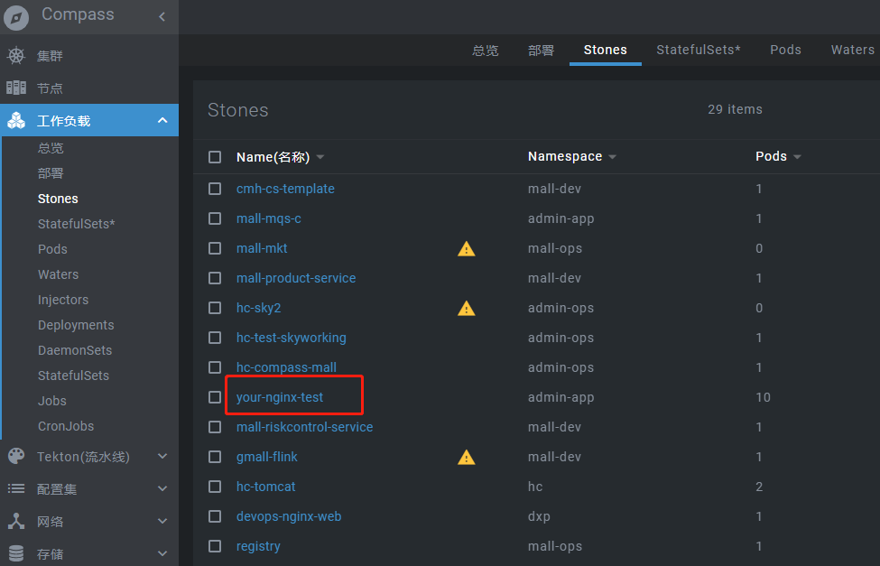
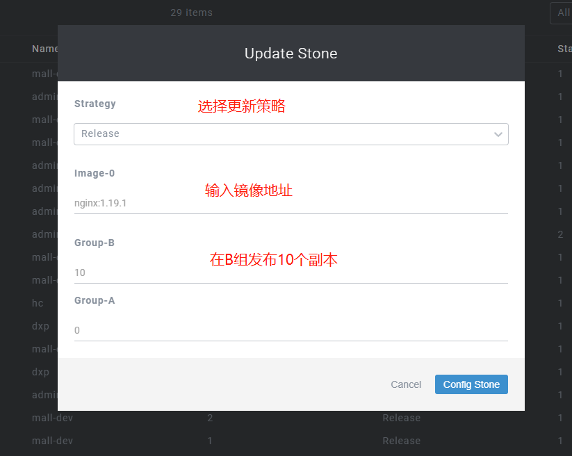
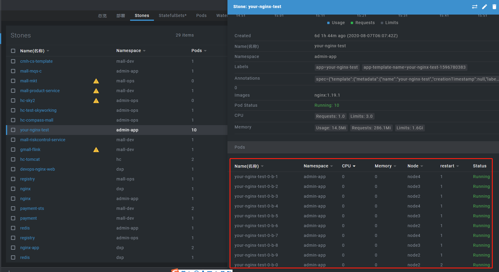

# 更新策略

::: tip
假如应用之前已经部署过了，我们需要发布的新的版本，使用更新策略，不需要重新创建部署模板，并且能平滑的升级。
:::

部署模板经过部署成功之后，会自动为我们创建一个stone资源来管理我们的应用。
所以，更新应用主要是在stone页面进行操作

1、进入stone页面，点击需要更新的stone资源名称，或者点击该条记录尾部的菜单按钮

2、编辑配置页

在现实中,发布中的失败或者密集起应用会让机器的资源抖动,所以设计以下策略的方式

- Alpha 多组发布中,找最小组号的一个节点发布1个pod测试发布
- Beta 在每个组中都发布1个pod
- Omega 在每个组中依照node的数据覆盖每个pod
- Release 按照预期发布的方式发布

选择Release模式

3、提交表单之后，可以看到发布了10个副本

::: tip
注意，我们在编写部署模板的时候，镜像拉取策略最好选择always。
否则，原有的pod不会自动拉取我们指定更新的镜像，需要删除原来的pod，才会更新成功。
::: 

