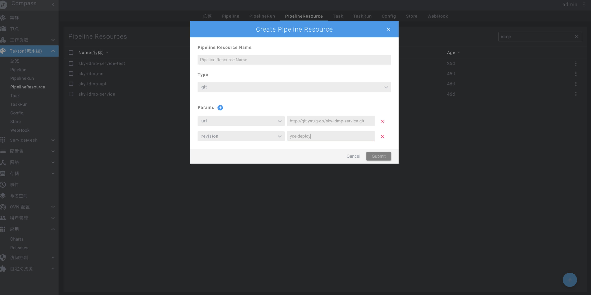
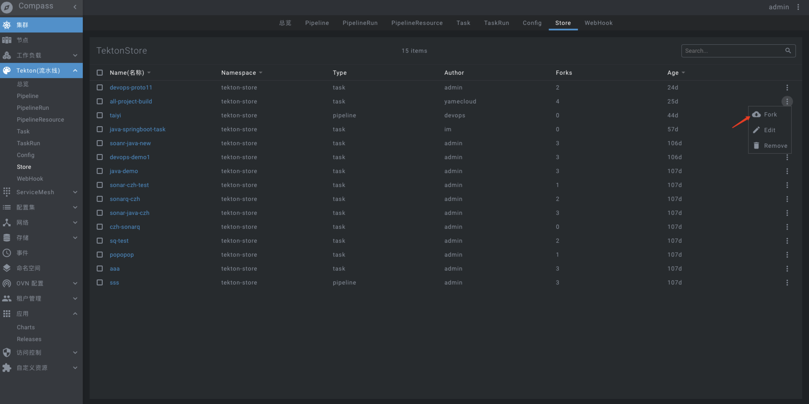
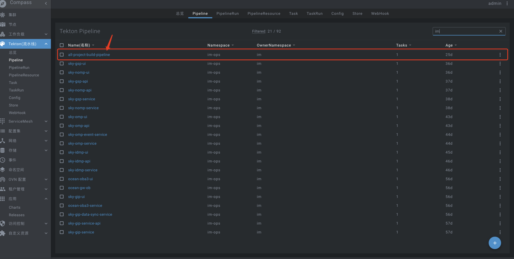
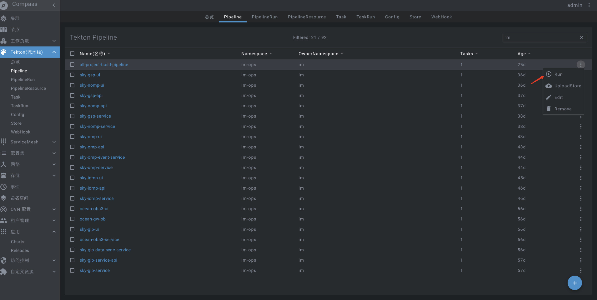
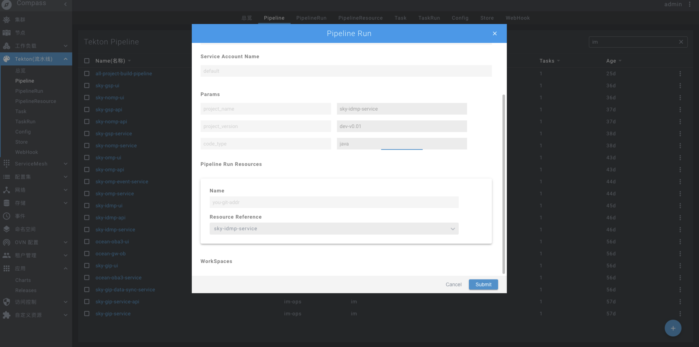
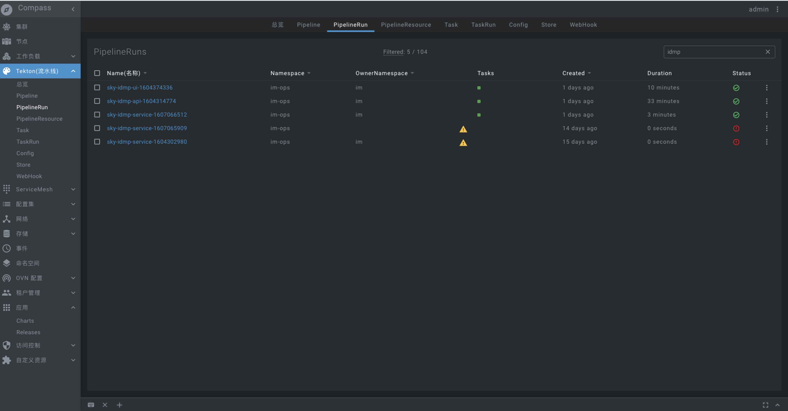
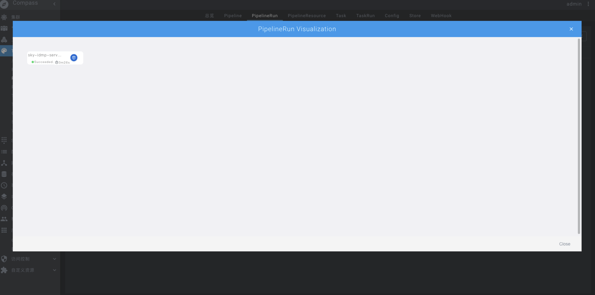

### 持续集成(最佳实践)

#### 配置项目`git`地址

点击`Tekton 流水线`下面的`PipelineResource`的右下角有个`➕（大加号）`，，然后如上图所示
- 名称：填写你自己项目的名称
- 类型：
   - git: 代表是git类型
   - image: 代表镜像类型
- Param:
   - url: git仓储地址。 如: `http://git.ym/g-ob/sky-idmp-service.git`
   - revision：分支名字。 如：`master`

点击保存即可

#### 从tekton-store(应用商店)下载`all-project-build`的模版
 
> 如下图

点击`Fork`即可在`Pipeline`专栏发现自己fork的模板

如上图所示，改条目是我们从应用商店`Fork`过来的

#### 配置Pipeline

点击右边的菜单属性选项。有个`RUN`将会弹出一个`Dialog`

如上图所示：
步骤如下

- **关注重点`Params`**:
   - project_name:项目的名称。
   - project_version:项目的版本(你们自己项目所迭代的版本比如v0.0.1)
   - code_type: `django` `web` `java`

- **Pipeline Run Resource**

   - 选取我们刚才配置的`PipelineResource`的`sky-idmp-service`(也是你自己配置的git地址配置)

  
- **点击提交即可**

#### PipelineRun介绍

上图是整体的在跑的`Pipeline`,名称，创建时间,耗时，以及状态等。

**点击蓝色的名称会弹出一个Dialog**

**Dialog如下**

**点击node弹出日志**
