# 应用部署

::: tip

​	本节教程主要是利用Compass来发布一个nginx服务,做一个简单的教程。

:::

## 创建CD模板

1、进入部署页面

2、点击创建按钮

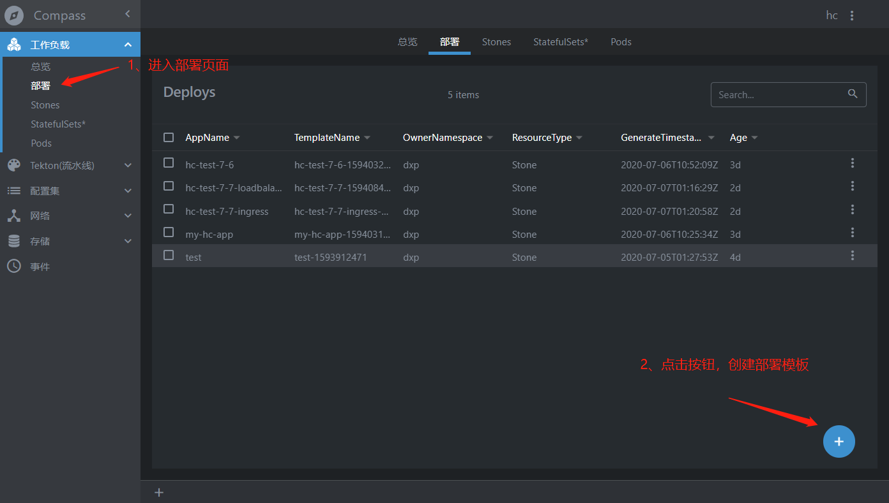

填写表单内容，涉及3个模块

- Base （填写名称等基本信息）

- Containers （填写容器配置）

- Service （服务发现相关配置）

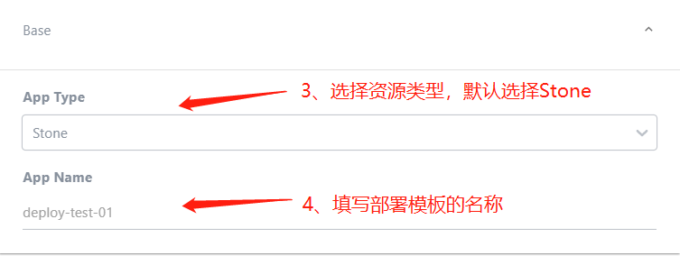

::: tip

​	Image From镜像来源，public是共有镜像地址，如DockerHub

:::

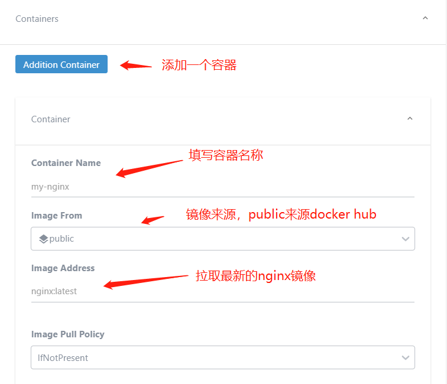

## 方法一：loadBlancer服务发现

::: tip

​	service type 选择LoadBalance类型，k8s自动分配内网ip地址

​	服务发现类型如果用Ingress，service type 选择ClusterIP类型，然后创建Ingress做域名绑定，下面会有教程。

:::

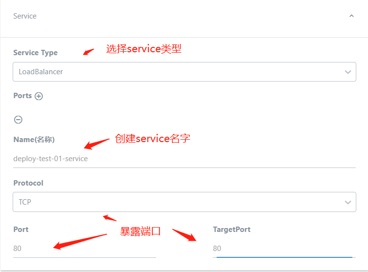

## 启动模板

::: tip

​	提交表单之后，得到一条新的记录，点击纪律右边的菜单，选择部署

:::

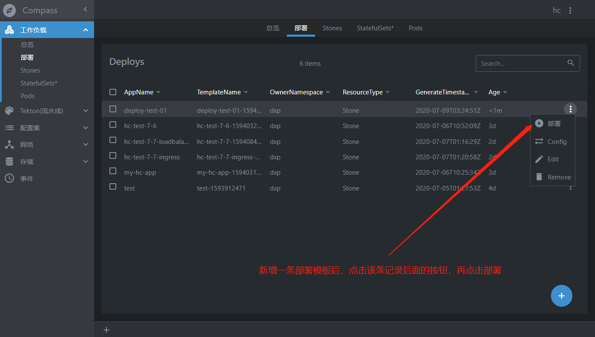

::: tip

​	选择默认发布到哪个命名控件，选择存储类型，不需要可以不选

:::

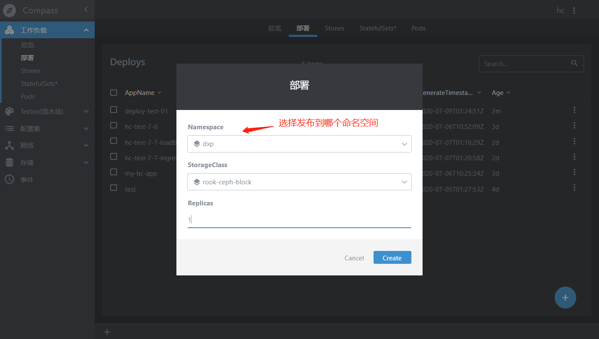

## 访问应用

::: tip

​	已经通过内网ip访问到nginx服务

:::

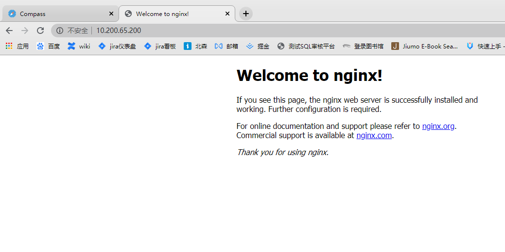

## 方法二：Ingress服务发现

::: tip

使用Ingress做服务发现，操作和上面差不多。

下面是compass文档项目使用Ingress方式的部署过程，主要区别是在创建部署模板的时候，service type类型选择ClusterIP。

:::

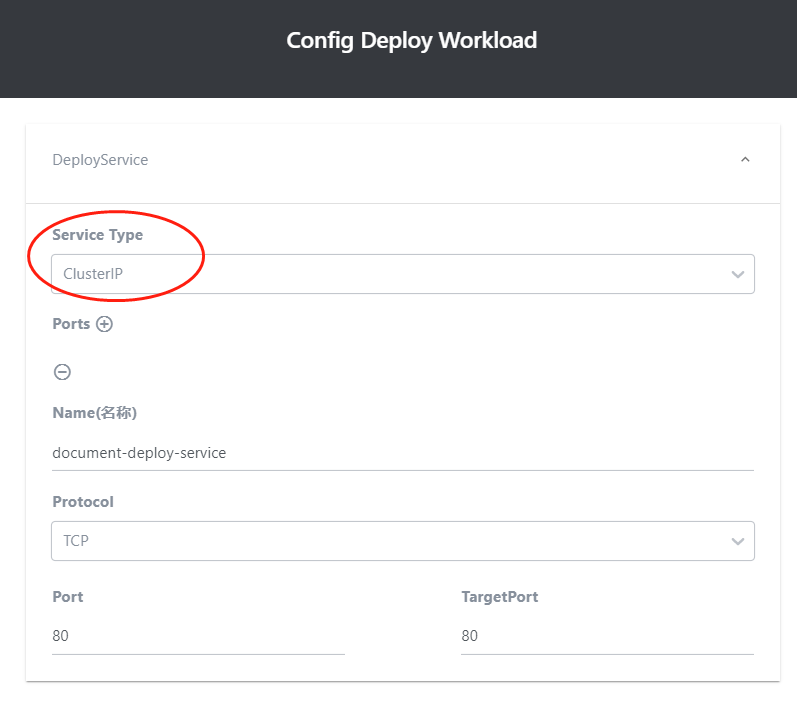

::: tip

创建好部署模板，启动模板成功之后，我们来到service页面，会发现一条自动创建好的service

document-deploy-0-b

:::

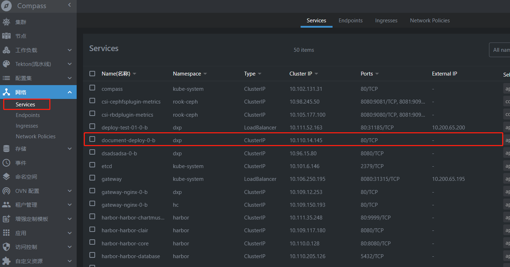

::: tip

接着我们要去Ingress页面创建Ingress

:::

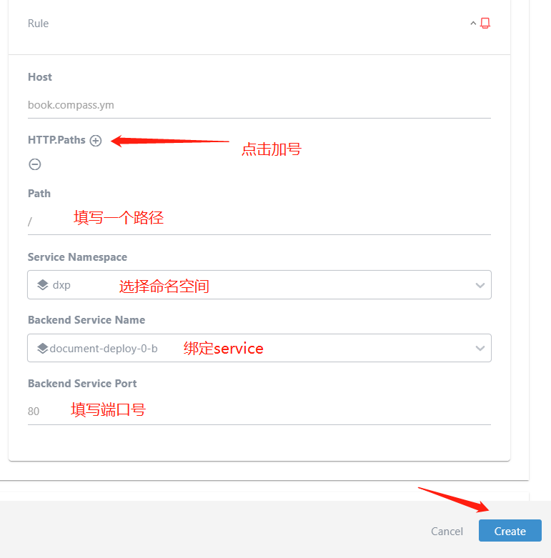

## 访问域名

::: tip

浏览器输入 book.compass.ym

:::

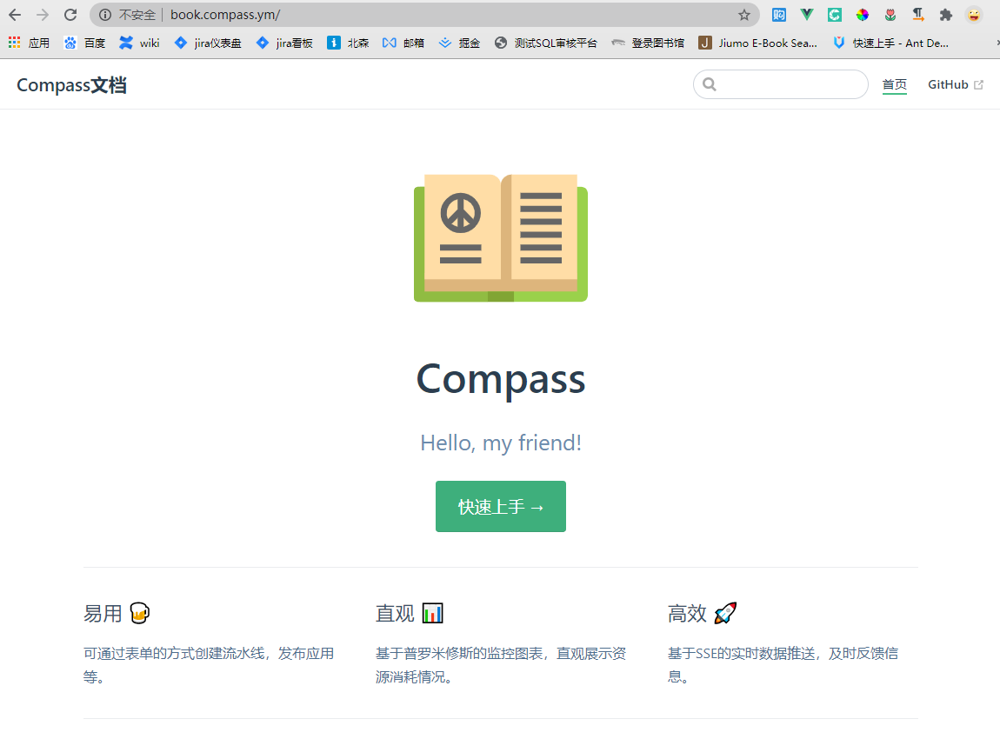