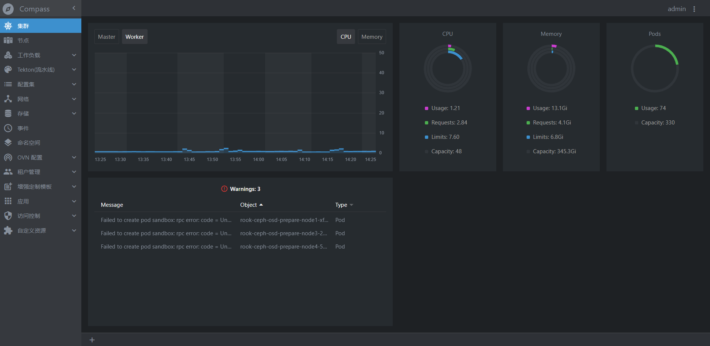

# 简单的CI

## 创建Task

``` js {4}
# 安装
yarn global add vuepress # 或者：npm install -g vuepress

# 新建一个 markdown 文件
echo '# Hello VuePress!' > README.md

# 开始写作
vuepress dev .

# 构建静态文件
vuepress build .

```

## 创建Pipeline



## 启动Pipeline
