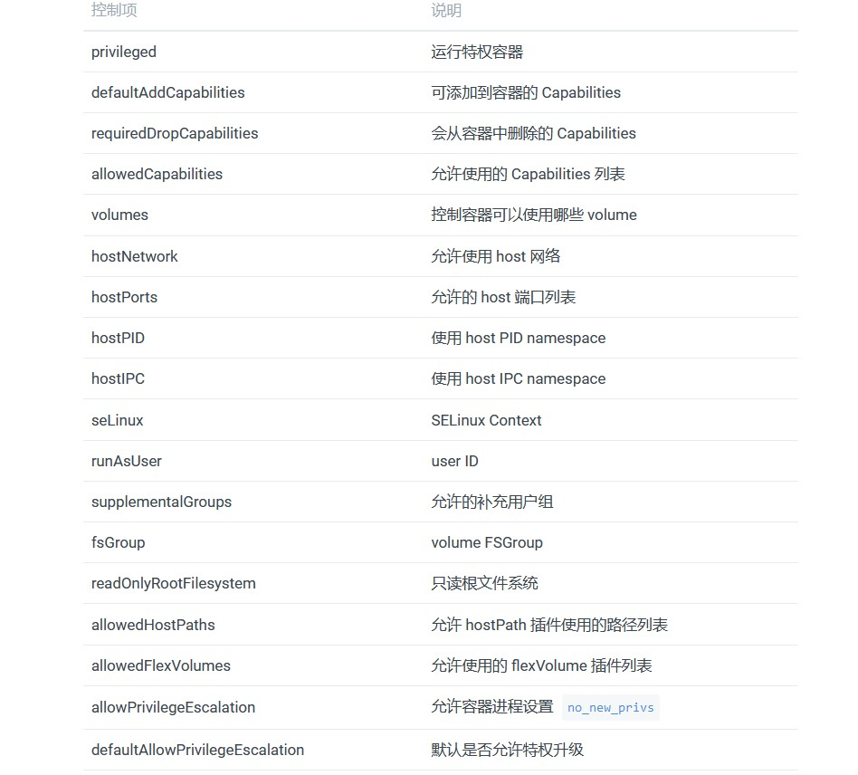

# 访问控制

### Service Accounts
Service account 是为了方便 Pod 里面的进程调用 Kubernetes API 或其他外部服务而设计的。
它与 User account 不同：
- User account 是为人设计的，而 service account 则是为 Pod 中的进程调用 Kubernetes API 而设计。
- User account 是跨 namespace 的，而 service account 则是仅局限它所在的 namespace。
- 每个 namespace 都会自动创建一个 default service account。
- Token controller 检测 service account 的创建，并为它们创建 secret。
- 开启 ServiceAccount Admission Controller 后:
- 每个 Pod 在创建后都会自动设置 spec.serviceAccountName 为 default（除非指定了其他 ServiceAccout）。
- 验证 Pod 引用的 service account 已经存在，否则拒绝创建。
- 如果 Pod 没有指定 ImagePullSecrets，则把 service account 的 ImagePullSecrets 加到 Pod 中。
- 每个 container 启动后都会挂载该 service account 的 token 和 ca.crt 到 /var/run/secrets/kubernetes.io/serviceaccount/。

### Roles
Role：角色,它其实是一组规则,定义了一组对 Kubernetes API 对象的操作权限。

### Role Bindings
角色绑定，定义了“被作用者”和“角色”的绑定关系。

### Pod Security Policies
Pod Security Policies（PSP）是集群级的 Pod 安全策略，自动为集群内的 Pod 和 Volume 设置 Security Context。
使用 PSP 需要 API Server 开启 extensions/v1beta1/podsecuritypolicy，并且配置 PodSecurityPolicy admission 控制器。
说明：

