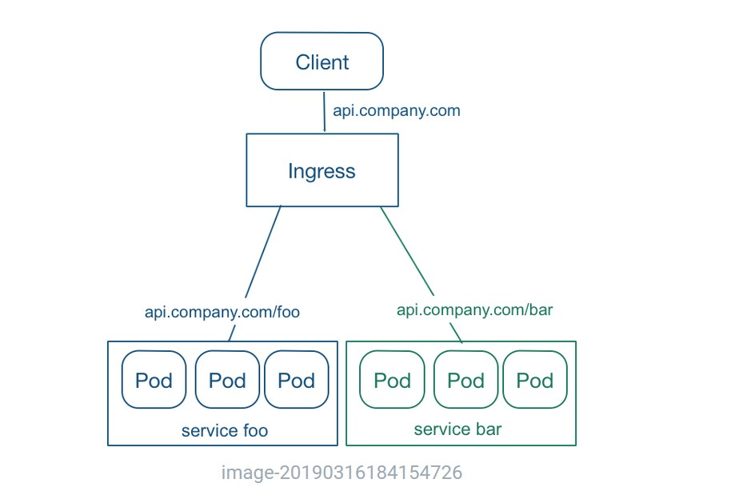

# 网络

::: tip

该部分针对容器的服务发现与负载均衡。

:::

### Services
Service 是对一组提供相同功能的 Pods 的抽象，并为它们提供一个统一的入口。借助 Service，应用可以方便的实现服务发现与负载均衡，并实现应用的零宕机升级。Service 通过标签来选取服务后端，一般配合 Replication Controller 或者 Deployment 来保证后端容器的正常运行。这些匹配标签的 Pod IP 和端口列表组成 endpoints，由 kube-proxy 负责将服务 IP 负载均衡到这些 endpoints 上。
Service 有四种类型：
- ClusterIP：默认类型，自动分配一个仅 cluster 内部可以访问的虚拟 IP
- NodePort：在 ClusterIP 基础上为 Service 在每台机器上绑定一个端口，这样就可以通过 <NodeIP>:NodePort 来访问该服务。如果 kube-proxy 设置了 --nodeport-addresses=10.240.0.0/16（v1.10 支持），那么仅该 NodePort 仅对设置在范围内的 IP 有效。
- LoadBalancer：在 NodePort 的基础上，借助 cloud provider 创建一个外部的负载均衡器，并将请求转发到 <NodeIP>:NodePort
- ExternalName：将服务通过 DNS CNAME 记录方式转发到指定的域名（通过 spec.externlName 设定）。需要 kube-dns 版本在 1.7 以上。
另外，也可以将已有的服务以 Service 的形式加入到 Kubernetes 集群中来，只需要在创建 Service 的时候不指定 Label selector，而是在 Service 创建好后手动为其添加 endpoint。

### Endpoints
端点待续

### Ingresses
通常情况下，service 和 pod 的 IP 仅可在集群内部访问。集群外部的请求需要通过负载均衡转发到 service 在 Node 上暴露的 NodePort 上，然后再由 kube-proxy 通过边缘路由器 (edge router) 将其转发给相关的 Pod 或者丢弃。
而 Ingress 就是为进入集群的请求提供路由规则的集合，如下图所示：

Ingress 可以给 service 提供集群外部访问的 URL、负载均衡、SSL 终止、HTTP 路由等。为了配置这些 Ingress 规则，集群管理员需要部署一个 Ingress controller，它监听 Ingress 和 service 的变化，并根据规则配置负载均衡并提供访问入口。

### Network Policies
随着微服务的流行，越来越多的云服务平台需要大量模块之间的网络调用。它使用标签选择器模拟传统的分段网络，并通过策略控制它们之间的流量以及来自外部的流量。
网络策略:
- Namespace 隔离，默认情况下，所有 Pod 之间是全通的。每个 Namespace 可以配置独立的网络策略，来隔离 Pod 之间的流量。
- Pod 隔离，通过使用标签选择器（包括 namespaceSelector 和 podSelector）来控制 Pod 之间的流量。