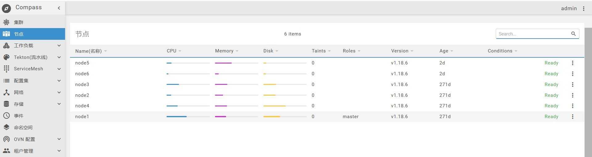

# 节点

::: tip

此版块包含集群中所有物理节点，目前共有6个节点，分为1主（master）和5从节点（slaver），可查看每个节点cpu、memory、disk的使用情况。点击每个节点，可查看该节点的详细信息，包含：cpu、memory、disk、pods等。

:::

如下图：

点击单个节点查看单节点详细信息，图如下：

点击节点右侧即可操作对应节点，如图：

注：LabelNodeGEO操作是标识节点的地理位置，方便后续的发布可以具体到某个机房的某个机架的某台机器上。