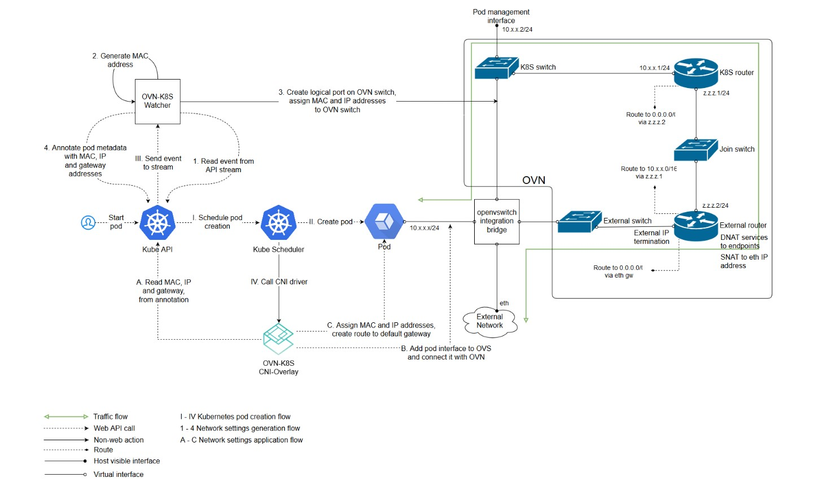

# OVN配置

::: tip

ovn-kubernetes 提供了一个ovs OVN 网络插件，支持 underlay 和 overlay 两种模式。

:::

- underlay：容器运行在虚拟机中，而ovs则运行在虚拟机所在的物理机上，OVN将容器网络和虚拟机网络连接在一起。
- overlay：OVN通过logical overlay network连接所有节点的容器，此时ovs可以直接运行在物理机或虚拟机上。

### Overlay模式

### ovs
ovs是对单机网络进行虚拟化的一个工具,它最基本的功能是实现了一个虚拟交换机，可以把虚拟网卡和虚拟交换机的端口连接，这样一个交换机下的多个网卡网络就打通了，类似于linux bridge 的功能，再之上，ovs很重要的一点就是支持openflow，这是一种可编程的流量控制语言，可以方便我们以编程的方式对流量进行控制，例如转发，拒绝，更改包信息，nat，qos 等等。此外ovs还支持多组网络流量监控的协议，方便我们可视化监控并跟踪整个虚拟网络的流量情况。ovs 只是一个单机的软件，它并没有集群的信息，自己无法了解整个集群的虚拟网络状况,而ovn提供了一个集中式的 ovs 控制器，这样我们就可以从集群的角度对整个网络设施进行编排。

### NetworkAttachmentDefinition
多网卡的路由和网卡信息配置。

### subnet
Kube-OVN 中以子网来组织 IP，每个 Namespace 可以归属于不同的子网，Namespace 下的 Pod 会自动从所属的子网中获取 IP 并共享子网的网络配置（CIDR，网关类型，访问控制，NAT控制等）。

为了方便用户的快速上手使用，Kube-OVN 内置了一个默认子网，所有未显式声明子网归属的 Namespace 会自动从默认子网中分配 IP，并使用默认子网的网络信息。其中默认子网使用了分布式网关并对出网流量进行 NAT 转换，其行为和 flannel 的默认行为一致，用户无需额外的配置即可使用到大部分的网络功能。