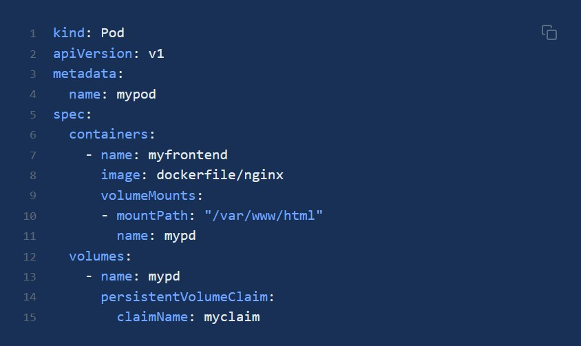

# 存储

### Persistent Volume Claims
PersistentVolumeClaim (PVC) 是对 PV 的请求。PVC 跟 Pod 类似：Pod 消费 Node 资源，而 PVC 消费 PV 资源；Pod 能够请求 CPU 和内存资源，而 PVC 请求特定大小和访问模式的数据卷。

PVC 可以直接挂载到 Pod 中：

### Persistent Volumes
PersistentVolume（PV）是集群之中的一块网络存储。跟 Node 一样，也是集群的资源。PV 跟 Volume (卷) 类似，不过会有独立于 Pod 的生命周期。
PV 的访问模式（accessModes）有三种：
- ReadWriteOnce（RWO）：是最基本的方式，可读可写，但只支持被单个节点挂载。
- ReadOnlyMany（ROX）：可以以只读的方式被多个节点挂载。
- ReadWriteMany（RWX）：这种存储可以以读写的方式被多个节点共享。不是每一种存储都支持这三种方式，像共享方式，目前支持的还比较少，比较常用的是 NFS。在 PVC 绑定 PV 时通常根据两个条件来绑定，一个是存储的大小，另一个就是访问模式。

PV 的回收策略（persistentVolumeReclaimPolicy，即 PVC 释放卷的时候 PV 该如何操作）也有三种:
- Retain，不清理, 保留 Volume（需要手动清理）。
- Recycle，删除数据，即 rm -rf /thevolume/*（只有 NFS 和 HostPath 支持）。
- Delete，删除存储资源，比如删除 AWS EBS 卷（只有 AWS EBS, GCE PD, Azure Disk 和 Cinder 支持）。

### Storage Classes
StorageClass 为管理员提供了描述存储 "类" 的方法，实现了存储的动态供给，简单来说，StorageClass能够根据pvc来自动创建pv，减轻了集群管理员创建pv的负担。
StorageClass 包括四个部分：
- provisioner：指定 Volume 插件的类型，包括内置插件（如 kubernetes.io/glusterfs）和外部插件（如 external-storage 提供的 ceph.com/cephfs）。
- mountOptions：指定挂载选项，当 PV 不支持指定的选项时会直接失败。比如 NFS 支持 hard 和 nfsvers=4.1 等选项。
- parameters：指定 provisioner 的选项，比如 kubernetes.io/aws-ebs 支持 type、zone、iopsPerGB 等参数。
- reclaimPolicy：指定回收策略，同 PV 的回收策略。
在使用 PVC 时，可以通过 DefaultStorageClass 准入控制设置默认 StorageClass, 即给未设置 storageClassName 的 PVC 自动添加默认的 StorageClass。而默认的 StorageClass 带有 annotation storageclass.kubernetes.io/is-default-class=true。