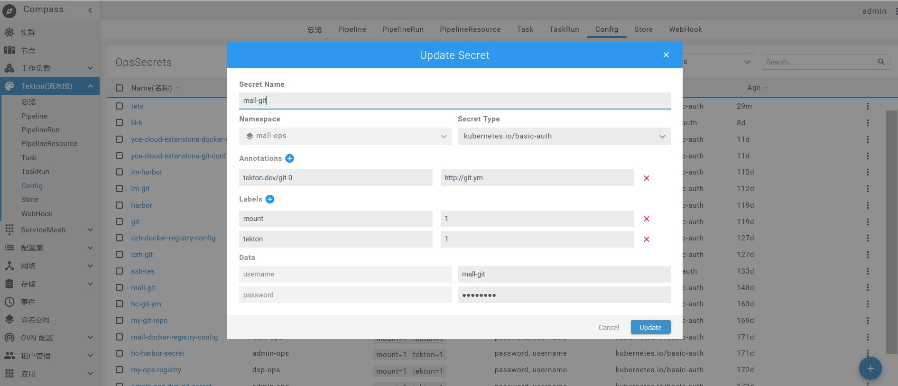

# tekton流水线

::: tip

tekton流水线主要是操作将代码打包成镜像即CI。

:::

### 总览

在此板块即可查看5大资源（task、taskRun、pipelineResource、pipeline、pipelineRun）的运行情况。图如下：

### 五大资源（task、taskRun、pipelineResource、pipeline、pipelineRun）请参照[持续集成](/guide/basic/ci/)

### config
配置中心，用于构建打包应用。比如现在需要打包商城应用，依赖商城git代码，我们为了能获取商城对应的git代码，需要新增配置，点击右下角+号，新增配置，图如下：

说明：
- Annotations 是 key/value 形式附加于对象的注解。不同于 Labels 用于标志和选择对象，Annotations 则是用来记录一些附加信息，用来辅助应用部署、安全策略以及调度策略等。比如 deployment 使用 annotations 来记录 rolling update 的状态。
- Label 是识别 Kubernetes 对象的标签，以 key/value 的方式附加到对象上（key 最长不能超过 63 字节，value 可以为空，也可以是不超过 253 字节的字符串）。
Label 不提供唯一性，并且实际上经常是很多对象（如 Pods）都使用相同的 label 来标志具体的应用。
Label 定义好后其他对象可以使用 Label Selector 来选择一组相同 label 的对象（比如 ReplicaSet 和 Service 用 label 来选择一组 Pod）。Label Selector 支持以下几种方式：
	- 等式，如 app=nginx 和 env!=production
	- 集合，如 env in (production, qa)
	- 多个 label（它们之间是 AND 关系），如 app=nginx,env=test，mount挂载到pod，pod启动时会应用此配置。
- Data域即为访问git仓库的用户名和密码。

### Store
存放pipeline模板的地方，点击模板右侧fork，即可复制出一份pipeline，该复制出的pipeline资源在tekton-pipeline列表中可见。
点击模板右侧fork，如下图：

复制出的pipeline资源，图如下：

具体模板上传到store参见：[模板商店](/guide/advanced/store/)

### WebHook
添加webhook后，git代码提交之后触发pipelineRun启动进行构建。具体见：[webhook](/guide/advanced/webhook/)