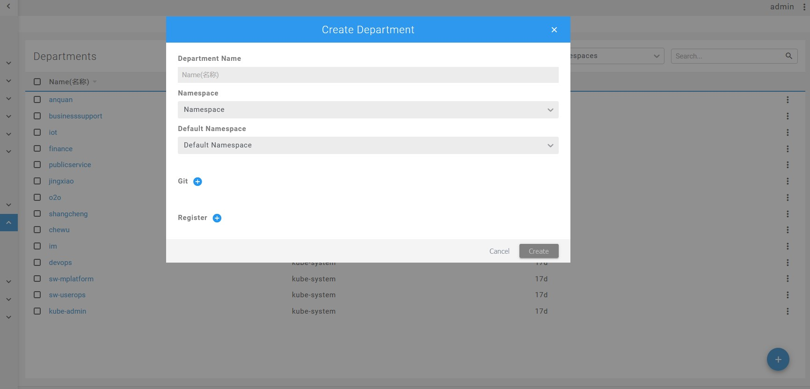
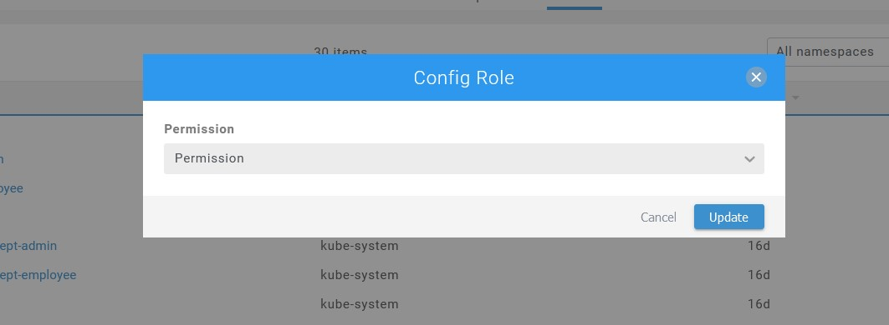

# 租户管理

::: tip

使用云服务的个人或组织在云服务的内部被称为租户。租户管理主要包含：部门、角色和权限。租户的权限根据该租户所在部门和所在职位（角色）来分配。

:::

### Departments
部门或组织，在服务内部需保持唯一。个人可属于多个部门或组织。
创建部门：

### Roles
角色，创建角色名称需唯一。为该角色分配相应权限。如图：

### Users
用户个体，创建用户时绑定对应的部门和角色，从而拥有分配的操作权限。