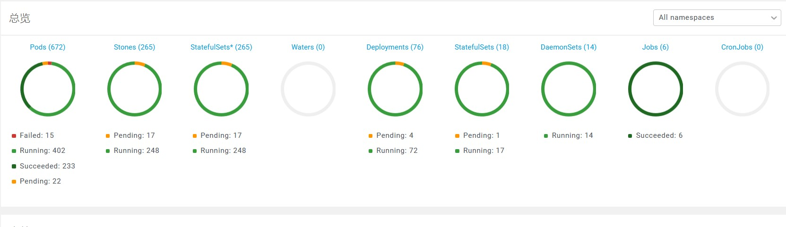
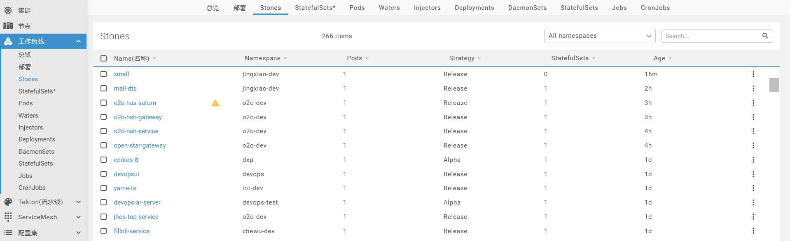
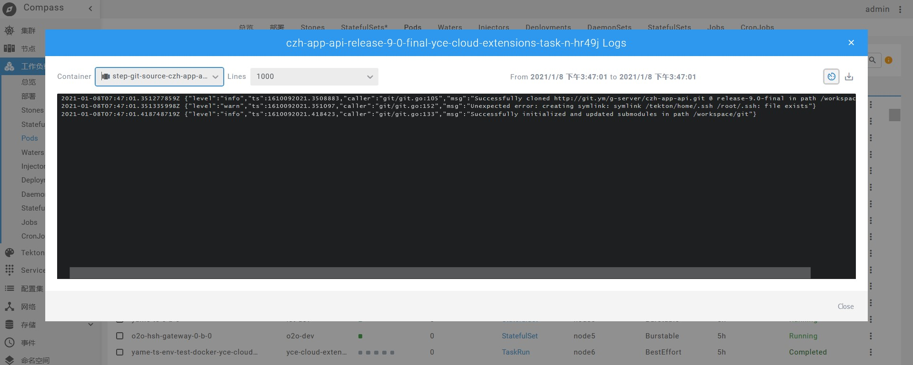
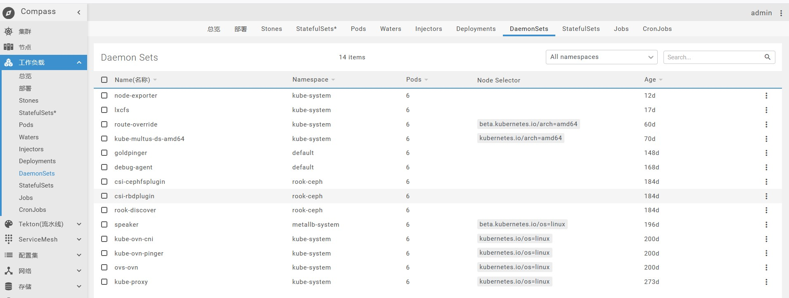
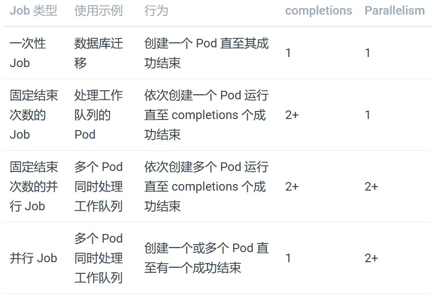
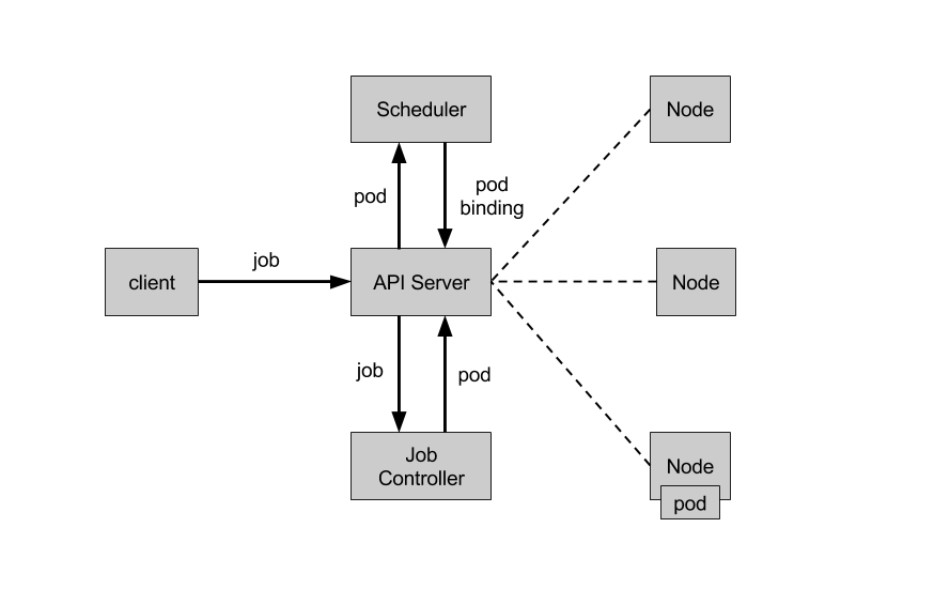
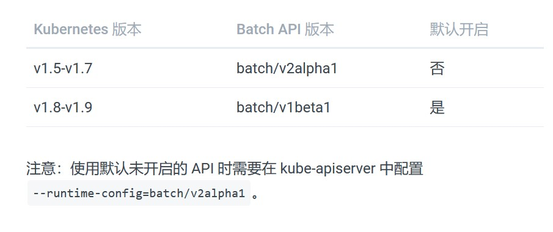

# 工作负载

::: tip

工作负载主要是控制应用部署阶段。

:::

### 总览
在此版块可查看资源（Pods、Stones、StatefulSets*、Water、Deployments、StatefulSet、DeamonSet、Jobs、CronJobs）的总体情况。如下图：

### 部署
部署模板，表示用户对K8s集群的一次更新操作。部署是一个比RS（副本集：提供高可用能力，能支持更多种类的匹配模式。副本集对象一般不单独使用，而是作为Deployment的理想状态参数使用）应用模式更广的API对象，可以是创建一个新的服务，更新一个新的服务，也可以是滚动升级一个服务。滚动升级一个服务，实际是创建一个新的RS，然后逐渐将新RS中副本数增加到理想状态，将旧RS中的副本数减小到0的复合操作；这样一个复合操作用一个RS是不太好描述的，所以用一个更通用的Deployment来描述。
应用部署实例参照：[应用部署](/guide/basic/cd/)

### Stones
有状态的资源管理。基于k8s原生资源Statefulset的高级实现。
- 支持地理位置标识发布,可以具体到某个机房的某个机架上的某台机器上的发布。
- 支持按组发布策略:Alpha,Beta,Omega,Release发布。
资源发布策略：
- Alpha: 挑选其中一组的一个发布1个Pod。
- Beta: 挑选(多组/一组)的一个发布1个Pod。
- Omega: 挑选多组的每个机器上发布1个Pod。
- Release: 全量发布。
部署模板经过部署成功之后，会自动为我们创建一个stone资源来管理我们的应用。
图如下：

资源更新详见：[更新策略](/guide/advanced/update/)

### Stateful Sets*
有状态服务集。由于原生的Statefulset提供了基本的发布策略不能满足我们的场景,比如不支持跨机房发布,按组批量发布等，所以产生了我们自己的一套Stateful Sets来满足这些要求。

### Pods
K8s有很多技术概念，同时对应很多API对象，最重要的也是最基础的是微服务Pod。Pod是在K8s集群中运行部署应用或服务的最小单元，它是可以支持多容器的。Pod的设计理念是支持多个容器在一个Pod中共享网络地址和文件系统，可以通过进程间通信和文件共享这种简单高效的方式组合完成服务。Pod对多容器的支持是K8s最基础的设计理念。比如你运行一个操作系统发行版的软件仓库，一个Nginx容器用来发布软件，另一个容器专门用来从源仓库做同步，这两个容器的镜像不太可能是一个团队开发的，但是他们一块儿工作才能提供一个微服务；这种情况下，不同的团队各自开发构建自己的容器镜像，在部署的时候组合成一个微服务对外提供服务。
点击pod右侧，Logs打开日志控制台，图如下：

### Waters
无状态的资源。Water资源是高级的Deployment资源的实现。优势：
- 支持地理位置标识发布,可以具体到某个机房的某个机架上的某台机器上的发布。
- 支持细腻的发布策略:Alpha,Beta,Release发布。
发布策略：
- Alpha: 找到一个节点,仅且发布一个Pod,等待用户确认是否有误。
- Beta: 在每个Node上都发布Pod。
- Release: 全量发布。
出现这种发布策略,是因为发布的Pod本身是错误的(比如缺少配置导致程序启动错误),如果大量发布，会导致机器的抖动，影响正在运行的Pod的运行,尽可能的把抖动降到最低,让用户确认发布的第一个Pod是否有误,确认会进行下一次发布。

### Injectors
动态资源注入。Injector资源结合CRD+Sidecar方式的实现是为了让用户动态的注入日志收集,配置文件,链路追踪的agent的注入。支持在业务容器前和后注入,和Water资源和Stone资源结合,当Water被delete,相应的Injector资源也会被GC。

### Deployments
动态资源部署，Deployment 为 Pod 和 ReplicaSet 提供了一个声明式定义 (declarative) 方法，用来替代以前的 ReplicationController 来方便的管理应用。
Deployment 的 典型应用场景 包括：
- 定义 Deployment 来创建 Pod 和 ReplicaSet
- 滚动升级和回滚应用
- 扩容和缩容
- 暂停和继续 Deployment

### Daemon Sets
后台支撑服务集（DaemonSet）。长期伺服型和批处理型服务的核心在业务应用，可能有些节点运行多个同类业务的Pod，有些节点上又没有这类Pod运行；而后台支撑型服务的核心关注点在K8s集群中的节点（物理机或虚拟机），要保证每个节点上都有一个此类Pod运行。节点可能是所有集群节点也可能是通过nodeSelector选定的一些特定节点。典型的后台支撑型服务包括，存储，日志和监控等在每个节点上支撑K8s集群运行的服务。界面如下图：

### Stateful Sets
StatefulSet 是为了解决有状态服务的问题（对应 Deployments 和 ReplicaSets 是为无状态服务而设计），其应用场景包括：
- 稳定的持久化存储，即 Pod 重新调度后还是能访问到相同的持久化数据，基于 PVC 来实现。
- 稳定的网络标志，即 Pod 重新调度后其 PodName 和 HostName 不变，基于 Headless Service（即没有 Cluster IP 的 Service）来实现。
- 有序部署，有序扩展，即 Pod 是有顺序的，在部署或者扩展的时候要依据定义的顺序依次依序进行（即从 0 到 N-1，在下一个 Pod 运行之前所有之前的 Pod 必须都是 Running 和 Ready 状态），基于 init containers 来实现。
- 有序收缩，有序删除（即从 N-1 到 0）。

从上面的应用场景可以发现，StatefulSet 由以下几个部分组成：
	- 用于定义网络标志（DNS domain）的 Headless Service。
	- 用于创建 PersistentVolumes 的 volumeClaimTemplates。
	- 定义具体应用的 StatefulSet。

StatefulSet 中每个 Pod 的 DNS 格式为 statefulSetName-{0..N-1}.serviceName.namespace.svc.cluster.local，其中：
	- serviceName 为 Headless Service 的名字。
	- 0..N-1 为 Pod 所在的序号，从 0 开始到 N-1。
	- statefulSetName 为 StatefulSet 的名字。
	- namespace 为服务所在的 namespace，Headless Service 和 StatefulSet 必须在相同的 namespace。
	- .cluster.local 为 Cluster Domain。

#### StatefulSet 注意事项
- 推荐在 Kubernetes v1.9 或以后的版本中使用。
- 所有 Pod 的 Volume 必须使用 PersistentVolume 或者是管理员事先创建好。
- 为了保证数据安全，删除 StatefulSet 时不会删除 Volume。
- StatefulSet 需要一个 Headless Service 来定义 DNS domain，需要在 StatefulSet 之前创建好。

### Jobs
Job 负责批量处理短暂的一次性任务 (short lived one-off tasks)，即仅执行一次的任务，它保证批处理任务的一个或多个 Pod 成功结束。
#### Kubernetes 支持以下几种 Job：
	- 非并行 Job：通常创建一个 Pod 直至其成功结束。
	- 固定结束次数的 Job：设置 .spec.completions，创建多个 Pod，直到 .spec.completions 个 Pod 成功结束。
	- 带有工作队列的并行 Job：设置 .spec.Parallelism 但不设置 .spec.completions，当所有 Pod 结束并且至少一个成功时，Job 就认为是成功。
根据 .spec.completions 和 .spec.Parallelism 的设置，可以将 Job 划分为以下几种 pattern：

#### Job Controller
	- Job Controller 负责根据 Job Spec 创建 Pod，并持续监控 Pod 的状态，直至其成功结束。如果失败，则根据 restartPolicy（只支持 OnFailure 和 Never，不支持 Always）决定是否创建新的 Pod 再次重试任务。
	流程图如下：

#### Job Spec 格式
	- spec.template 格式同 Pod。
	- RestartPolicy 仅支持 Never 或 OnFailure。
	- 单个 Pod 时，默认 Pod 成功运行后 Job 即结束。
	- .spec.completions 标志 Job 结束需要成功运行的 Pod 个数，默认为 1。
	- .spec.parallelism 标志并行运行的 Pod 的个数，默认为 1。
	- spec.activeDeadlineSeconds 标志失败 Pod 的重试最大时间，超过这个时间不会继续重试。

### Cron Jobs
CronJob 即定时任务，就类似于 Linux 系统的 crontab，在指定的时间周期运行指定的任务。
#### API 版本对照表

#### CronJob Spec
可以用 kubectl run 来创建一个 CronJob：kubectl run hello --schedule="*/1 * * * *" --restart=OnFailure --image=busybox -- /bin/sh -c "date; echo Hello from the Kubernetes cluster"。
查看cronjob：kubectl get cronjob。
删除cronjob：kubectl delete cronjob jobName。
注：删除 cronjob 的时候会删除它创建的 job 和 pod，并停止正在创建的 job

CronJob描述：
	- .spec.schedule 指定任务运行周期。
	- .spec.jobTemplate 指定需要运行的任务。
	- .spec.startingDeadlineSeconds 指定任务开始的截止期限。
	- .spec.concurrencyPolicy 指定任务的并发策略，支持 Allow、Forbid 和 Replace 三个选项。

